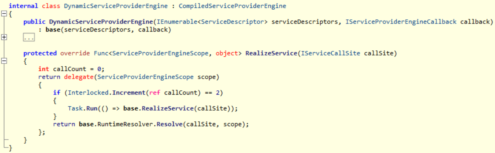

# Microsoft.Extensions.DependencyInjection 之一：解析实现

[TOC]

项目使用了 Microsoft.Extensions.DependencyInjection 2.x 版本，遇到第2次请求时非常高的内存占用情况，于是作了调查，**本文对 3.0 版本仍然适用**。

先说结论，可以转到`ServiceProvider`章节，为了在性能与开销中获取平衡，`Microsoft.Extensions.DependencyInjection`在初次请求时使用反射实例化组件，再次请求时异步使用表达式树替换了目标实例化委托，使得后续请求将得到性能提升。

## IServiceProviderEngine

依赖注入的核心是`IServiceProviderEngine`，它定义了`GetService()`方法，再被`IServiceProvider`间接调用。


`IServiceProviderEngine`包含若干实现，由`ServiceProvider`的构造函数的参数决定具体的实现类型。由于`ServiceProviderOptions.Mode`是内部可见枚举，默认值为`ServiceProviderMode.Dynamic `，`ServiceCollectionContainerBuilderExtensions.BuildServiceProvider()`作为入口没有控制能力，使得成员`_engine`是类型为`DynamicServiceProviderEngine`的实例。


最终实现类`DynamicServiceProviderEngine`从`CompiledServiceProviderEngine`继承，后者再从抽象类`ServiceProviderEngine`继承。

抽象类`ServiceProviderEngine`定义了方法`GetService(Type serviceType)`，并维护了默认可见性的线程安全的字典`internal ConcurrentDictionary<Type, Func<ServiceProviderEngineScope, object>> RealizedServices`，目标类型实例化总是先从该字典获取委托。


方法`ServiceProviderEngine.GetService()`并不是抽象方法，上述两个个实现类也没有重写。方法被调用时，`ServiceProviderEngine`的私有方法`CreateServiceAccessor(Type serviceType)`首先使用`CallSiteFactory`分析获取待解析类型的上下文`IServiceCallSite`，接着调用子类的`RealizeService(IServiceCallSite)`实现。

## ServiceProviderEngine

这里解析两个重要依赖`CallSiteFactory`和`CallSiteRuntimeResolver`，以及数据结构`IServiceCallSite`，前两者在`ServiceProviderEngine`的构造函数中得到实例化。


### CallSiteFactory

`ServiceProviderEngine`以注入方式集合作为构建函数的参数，但参数被立即转交给了`CallSiteFactory`，后者在维护注入方式集合与了若干字典对象。

* `List<ServiceDescriptor> _descriptors`：所有的注入方式集合
* `Dictionary<Type, IServiceCallSite> _callSiteCache`：组件类型与其实现的上下文字典
* `Dictionary<Type, ServiceDescriptorCacheItem> _descriptorLookup`：使用组件类型分组后注入方式映射

`ServiceDescriptorCacheItem`是维护了`List<ServiceDescriptor>`的结构体，`CallSiteFactory`总是使用最后一个注入方式作为目标类型的实例化依据。


#### IServiceCallSite

`IServiceCallSite`是组件类型实例化上下文，`CallSiteFactory`通过方法`CreateCallSite()`创建`IServiceCallSite`，并通过字典`_callSiteCache`进行缓存。

* 首先尝试调用针对普通类型的`TryCreateExact()`方法；
* 如果前一步为空，接着尝试调用针对泛型类型的`TryCreateOpenGeneric()`方法；
* 如果前一步为空，继续深度调用针对可枚举集合的 `TryCreateEnumerable()`方法；
* `TryCreateEnumerable()`内部使用了`TryCreateExact()`和`TryCreateOpenGeneric()`

`CallSiteFactory`对不同注入方式有选取优先级，优先选取实例注入方式，其次选取委托注入方式，最后选取类型注入方式，以 `TryCreateExact()`为例简单说明：

1. 对于使用单例和常量的注入方式，返回`ConstantCallSite`实例；
2. 对于使用委托的注入方式，返回`FactoryCallSite`实例；
3. 对于使用类型注入的，`CallSiteFactory`调用方法`CreateConstructorCallSite()`；
    * 如果只有1个构造函数
       * 无参构造函数，使用 `CreateInstanceCallSite`作为实例化上下文；
       * 有参构造函数存，首先使用方法`CreateArgumentCallSites()`遍历所有参数，递归创建各个参数的 `IServiceCallSite` 实例，得到数组。接着使用前一步得到的数组作为参数， 创建出 `ConstructorCallSite`实例。
    * 如果多于1个构造函数，检查和选取最佳构造函数再使用前一步逻辑处理；
4. 最后添加生命周期标识

泛型、集合处理多了部分前置工作，在此略过。


如下流程图简要地展示了递归过程：

```flow
start=>start: 创建 IServiceCallSite
select-constructor=>operation: 选取合适的构造函数
check-construcctor-parameters=>condition: 无参构造函数?
CreateInstanceCallSite=>operation: 返回 CreateInstanceCallSite
CreateArgumentCallSites=>subroutine: 遍历所有参数创建 IServiceCallSite，
最终返回 ConstructorCallSite
end=>end: 结束框

start->select-constructor->check-construcctor-parameters
check-construcctor-parameters(yes)->CreateInstanceCallSite->end
check-construcctor-parameters(no)->CreateArgumentCallSites->select-constructor
```

### CallSiteRuntimeResolver

`CallSiteRuntimeResolver`从`CallSiteVisitor<ServiceProviderEngineScope, object>`继承，被抽象类`ServiceProviderEngine`依赖，被`DynamicServiceProviderEngine`间接引用。

由于组件类型实例化上下文已经由`CallSiteFactory`获取完成，该类的工作集中于类型推断与调用合适的方法实例化取组件。

* `ConstantCallSite`：获取引用的常量；
* `FactoryCallSite`：执行委托；
* `CreateInstanceCallSite`：反射调用`Activator.CreateInstance()`；
* `ConstructorCallSite`：递归实例化各个参数得到数组，接着作为参数反射调用`ConstructorInfo.Invoke()` ；

> 前面提到`ServiceProviderEngine`维护了字典，用于该委托的存取，后面继续会讲到。


`ServiceProviderEngine.GetService()`内部使用其私有方法`CreateServiceAccessor()`，传递`CallSiteFactory`获取到`IServiceCallSite`实例到子类重写的方法`RealizeService()`，故关注点回到`DynamicServiceProviderEngine`。

## DynamicServiceProviderEngine

`DynamicServiceProviderEngine`重写父类方法`RealizeService()`，返回了一个特殊的委托，委托内包含了对父类`CompiledServiceProviderEngine`和抽象类`ServiceProviderEngine`的成员变量的调用。



* 该委托被存储到`ServiceProviderEngine`维护的字典；
* 该委托被第1次调用时，使用`ServiceProviderEngine`内部类型为`CallSiteRuntimeResolver`的成员完成组件的实例化；
* 该委托被第2次调用时，除了第1步外，额外另起 Task 调用父类`CompiledServiceProviderEngine`内部类型为`ExpressionResolverBuilder`成员的方法`Resolve()`得到委托，替换前述的`ServiceProviderEngine`维护的字典内容。

> 委托的前2次执行结果总是由`ServiceProviderEngine.RuntimeResolver`返回的。


## CompiledServiceProviderEngine

`CompiledServiceProviderEngine`依赖了`ExpressionResolverBuilder`，并**操作了抽象类`ServiceProviderEngine`维护的字典对象`RealizedServices`。**


### ExpressionResolverBuilder

`ExpressionResolverBuilder`从`CallSiteVisitor<CallSiteExpressionBuilderContext, Expression>`继承，正如其名是表达式树的相关实现，其方法`Build()`构建和返回类型为`Func<ServiceProviderEngineScope, object>`的委托。


`ExpressionResolverBuilder`和 `CallSiteRuntimeResolver`一样继承了抽象类`CallSiteVisitor<TArgument, TResult>`，所以解析出表达式树的过程极其相似，根据 `IServiceCallSite`创建出表达式树。

* `ConstantCallSite`：使用`Expression.Constant()`；
* `FactoryCallSite`：使用`Expression.Invocation()`；
* `CreateInstanceCallSite`：使用 `Expression.New()`；
* `ConstructorCallSite`：递归创建各个参数的表达式树得到数组，接着作为参数，使用`Expression.New()` 创建最终的表达式树；

## ServiceProvider

回顾整个流程可知，`CallSiteFactory`、`CallSiteRuntimeResolver`、`ExpressionResolverBuilder`是组件实例化的核心实现：

* `CallSiteFactory`：解析和缓存组件的实例化上下文；
* `CallSiteRuntimeResolver`：使用反射完成组件的实例化；
* `ExpressionResolverBuilder`：使用表达式树得到组件的实例化的前置委托；

`ServiceProvider`通过特殊的委托完成了组件实例化方式的替换：

* 初次调用`GetService()`时
  * 首先通过`DynamicServiceProviderEngine`返回了委托，该委托被存储到字典 `RealizedServices`中；
  * 接着该委托被第1次执行，通过`CallSiteRuntimeResolver`完成组件的实例化；
* 再将调用`GetService()`时，
  * 直接得到缓存的委托并同样完成组件的实例
  * 同时通过一个额外的 Task，通过`ExpressionResolverBuilder` 使用表达式树重新生成委托，并操作字典`RealizedServices`，替换初次调用生成委托； 
* 后续调用`GetService()`时，字典`RealizedServices`查找到的是已经替换过的使用表达式树生成的委托。

> 没有线程安全问题，委托一定会被替换，视表达式树的构建完成时机。


## 小结

Microsoft.Extensions.DependencyInjection 2.x 希望在开销和性能中取得平衡，其实现方式是使用特殊委托完成委托本身的替换。``CallSiteVisitor` 是获取实例和表示式树的核心实现。

> 由于表达式创建的过程中不存在对参数的表达式树的缓存过程，故对于 A 依赖 B 的情况，如果只是获取 A ，使得 A 的表达式树构建完成并以委托形式缓存，单独获取 B 仍然要完成先反射后构造表达式的流程，见 [CompiledServiceProviderEngine](#compiledserviceproviderengine)。

掌握了 Microsoft.Extensions.DependencyInjection 2.x 的实现机制，加上对内存 dump 的对比，已经知道表达式树的构建过程是产生开销的原因，出于篇幅控制另行展开。