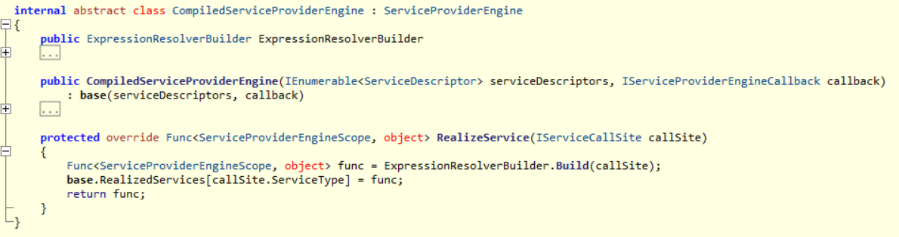

# Microsoft.Extensions.DependencyInjection 之三：展开测试

[TOC]

## 前文回顾

[Microsoft.Extensions.DependencyInjection 之一：解析实现](./Microsoft.Extensions.DependencyInjection 之一：解析实现) 提到了 Microsoft.Extensions.DependencyInjection 包含以下核心组件。

### IServiceCallSite

组件实例化上下文，包含许多实现，仅列举其中的`ConstantCallSite`，`CreateInstanceCallSite`，`ConstructorCallSite`如下。


`ConstructorCallSite`既是`IServiceCallSite`的实现类，又复合引用`IServiceCallSite`，以表达自身参数的构建形式。

组件生命周期也使用`IServiceCallSite`表达，它们既从`IServiceCallSite`继承，也引用`IServiceCallSite`。


### CallSiteFactory

当组件需要被实例化时，`CallSiteFactory`从维护的`ServiceDescriptor`查找注入方式，对类型注入的组件使用反射解析其构造函数，并递归解析其参数，最后缓存得到的`IServiceCallSite`实例。

```flow
start=>start: 创建 IServiceCallSite
select-constructor=>operation: 选取合适的构造函数
check-construcctor-parameters=>condition: 无参构造函数?
CreateInstanceCallSite=>operation: 返回 CreateInstanceCallSite
CreateArgumentCallSites=>subroutine: 遍历所有参数创建 IServiceCallSite，
最终返回 ConstructorCallSite
end=>end: 结束框

start->select-constructor->check-construcctor-parameters
check-construcctor-parameters(yes)->CreateInstanceCallSite->end
check-construcctor-parameters(no)->CreateArgumentCallSites->select-constructor
```
### ServiceProviderEngine

`ServiceProviderEngine`是抽象类，内部依赖`CallSiteRuntimeResolver`完成基于反射的组件实例化，并缓存了组件实例化的委托。


### CompiledServiceProviderEngine

`CompiledServiceProviderEngine`从`ServiceProviderEngine`继承，内部依赖`ExpressionResolverBuilder`完成基于表达式树的组件实例化的委托。



### DynamicServiceProviderEngine

`DynamicServiceProviderEngine`从`CompiledServiceProviderEngine`继承， 它创建的委托比较特殊： 

* 该委托第1次执行实际是 `ServiceProviderEngine` 内部的`CallSiteRuntimeResolver`调用
* 该委托第2次执行时开启异步任务，调用`CompiledServiceProviderEngine`内部的`ExpressionResolverBuilder`编译出委托并覆盖`ServiceProviderEngine`内部缓存。


为了印证该逻辑，这里使用 LINQPad 6 进行探索，该代码可以在控制台中运行， 但部分语句仅在 LINQPad 中生效。 

```c#
void Main() {
    var services = new ServiceCollection()
        .AddTransient<IFoo1, Foo1>()
        .BuildServiceProvider();
    var engine = ReflectionExtensions.GetNonPublicField(services, "_engine");
    var realizedServices = (System.Collections.IDictionary)ReflectionExtensions.GetNonPublicProperty(engine, "RealizedServices");

    for (int i = 0; i < 3; i++) {
        services.GetRequiredService<IFoo1>(); //组件实例化
        foreach (DictionaryEntry item in realizedServices) {
            var title = String.Format("Loop {0}, type {1}, hash {2}", i, ((Type)item.Key).FullName, item.Value.GetHashCode());
            item.Value.Dump(title, depth: 2); //仅被 LINQPad 支持
        }
        Thread.Sleep(10); //确保异步任务完成
    }
}

class ReflectionExtensions {
    public static Object GetNonPublicField(Object instance, String name) {
        var type = instance.GetType();
        var field = type.GetField(name, BindingFlags.NonPublic | BindingFlags.Instance);
        return field.GetValue(instance);
    }

    public static Object GetNonPublicProperty(Object instance, String name) {
        var type = instance.GetType();
        var property = type.GetProperty(name, BindingFlags.NonPublic | BindingFlags.Instance);
        return property.GetValue(instance);
    }
}

interface IFoo1 {
    void Hello();
}

class Foo1 : IFoo1 {
    public void Hello() {
        Console.WriteLine("Foo1.Hello()");
    }
}
```

运行该脚本，可以看到

* 第1次和第2次组件实例化，委托相同，hash 值都是 688136691，都是`Microsoft.Extensions.DependencyInjection.ServiceLookup.DynamicServiceProviderEngine`的内部委托；
* 第1次和第2次组件实例化的 `callSite`计数从1谈到2；
* 第3次组件实例例，委托变成了`System.Object lambda_method(...)`，hash 值变成了 1561307880；

> LINQPad 5 运行该脚本未能看到 hash 值变化，猜测是优化相关所致，考虑到DEBUG、单元测试和 LINQPad 6 已经实证，不再研究。


[Microsoft.Extensions.DependencyInjection 之二：使用诊断工具观察内存占用](./Microsoft.Extensions.DependencyInjection 之二：使用诊断工具观察内存占用) 对比了组件实例化前后的内存变化如下图，从第3次开始组件实例化的性能大幅提升。


在以上基础上得到作了小结：

> * 重度使用依赖注入的大型项目启动过程相当之慢；
> * 如果单次请求需要实例化的组件过多，前期请求的内存开销不可轻视；
> * 由于实例化伴随着递归调用，过深的依赖将不可避免地导致堆栈溢出；

## 测试参数

Microsoft.Extensions.DependencyInjection  中抽象类`Microsoft.Extensions.DependencyInjection.ServiceLookup.ServiceProviderEngine`有以下实现

* Microsoft.Extensions.DependencyInjection.ServiceLookup.CompiledServiceProviderEngine 
* Microsoft.Extensions.DependencyInjection.ServiceLookup.DynamicServiceProviderEngine 
* Microsoft.Extensions.DependencyInjection.ServiceLookup.ExpressionsServiceProviderEngine 
* Microsoft.Extensions.DependencyInjection.ServiceLookup.RuntimeServiceProviderEngine 
* Microsoft.Extensions.DependencyInjection.ServiceLookup.ILEmitServiceProviderEngine 

`RuntimeServiceProviderEngine` 是对 `ServiceProviderEngine` 的原样继承可以忽略，`ExpressionsServiceProviderEngine `和`CompiledServiceProviderEngine`都是表达式树的使用也没有差异。`ILEmitServiceProviderEngine`是 emit 相关的实现。

从[aspnet/DependencyInjection](https://github.com/aspnet/DependencyInjection.git) 获取到的分支release/2.1 后，提取到`ServiceProviderEngine`、`CompiledServiceProviderEngine`和`ILEmitServiceProviderEngine`等核心实现，再编写控制台程序，对依赖注入中反射、表达式树、emit 3种实现方式的开销和性能上进行探索。程序使用启动参数控制组件实例化行为，并记录测试结果，以下是程序启动参数的解释。


### -m\|method 

实例化方式，使用反射、表达式树与 Emit 参与了测试，分别对应：

* ref：使用反射实例化组件，实质是对 CallSiteRuntimeResolver 的调用；
* exp：使用表达式树实例化组件，实质是对 ExpressionResolverBuilder 的调用；
* emit：使用 emit 实例化组件，实质是对 ILEmitResolverBuilder 的调用；

```c#
Action<Type, Boolean> handle = default;
if (method == "ref")
{
	handle = GetRefService;
}
else if (method == "exp")
{
	handle = GetExpService;
}
else if (method == "emit")
{
	handle = GetEmitService;
}
```

### -t\|target

实例化目标，使用选取以下两种，配合参数 *-n\|number* 使用

* foo：使用 IFoo\_{n} 作为实例化目标，已定义了 IFoo_0、IFoo_1、IFoo_2 至 IFoo_9999 共1万个接口与对应实现
* bar：使用 IBar\_{n} 作为实例化目标，只定义了 IBar_100、IBar_1000、IBar_5000、IBar_10000 共4个接口，每个实现均以 IFoo 作为构造函数的参数，
  * IBar_100：使用 IFoo_0、IFoo_1 至 IFoo_99 作为构造函数参数；
  * IBar_1000：使用 IFoo_0、IFoo_1 至 IFoo_999 作为构造函数参数；
  * IBar_5000：使用 IFoo_0、IFoo_1 至 IFoo_4999 作为构造函数参数；
  * IBar_10000：使用 IFoo_0、IFoo_1 至 IFoo_9999 作为构造函数参数；

> 该部分同 [大量接口与实现类的生成](.) 一样仍然使用脚本生成。

### -n\|number

帮助指示实例化的目标及数量

* 100：target = foo 为从 IFoo_0、IFoo_1 至 IFoo_100 共100个接口，target =bar 则仅为 IBar_100；
* 1000：target = foo 为从 IFoo_0、IFoo_1 至 IFoo_1000 共1000个接口，target = bar 则仅为 IBar_1000；
* 5000：target = foo 为从 IFoo_0、IFoo_1 至 IFoo_5000 共5000个接口，target =bar 则仅为 IBar_5000；
* 10000：target = foo 为从 IFoo_0、IFoo_1 至 IFoo_10000 共10000个接口，target =bar 则仅为 IBar_10000；

### -c\|cache

缓存行为，cache = false 时每次都构建委托，cache = true 则把构建委托缓存起来重复使用。`GetRefService()`实现如下，`GetExpService()`和`GetEmitService()`相似。

```bash
static void GetRefService(Type type, Boolean cache)
{
    var site = _expEngine.CallSiteFactory.CreateCallSite(type, new CallSiteChain());
    Func<ServiceProviderEngineScope, object> func;
    if (cache)
    {
        func = _expEngine.RealizedServices.GetOrAdd(type, scope => _expEngine.RuntimeResolver.Resolve(site, scope));
    }
    else
    {
        func = scope => _expEngine.RuntimeResolver.Resolve(site, scope);
        _expEngine.RealizedServices[type] = func;
    }
    if (func == null)
    {
        _logger.Warn("Cache miss");
        return;
    }
    var obj = func(_expEngine.Root);
    if (obj == null)
    {
        throw new NotImplementedException();
    }
}
```

### -l\|loop

重复执行若干次，每次均记录测试时长

```c#
static void TestBar(Action<Type, Boolean> handle, String method, Boolean cache, Type type)
{
    _watch.Restart();
    handle(type, cache);
    _watch.Stop();
    _logger.Info("method {0}, cache {1}, target {2}, cost {3}",
        method, cache, type.Name, _watch.ElapsedMilliseconds);
}

...
TestBar(handle, method, false, number);
for (int i = 1; i < loop; i++)
{
    TestBar(handle, method, cache, number);
}
```

由于本测试的重点是对比使用反射、表达式树与 emit 的性能与开销，故程序启动后首先遍历 `ServiceCollection` 对每个组件调用 `CallSiteFactory.CreateCallSite(Type serviceType)`，确保组件的上下文已经被创建和缓存。

## 启动测试

对以上参数进行组合，得到以下启动方式，测试结果异步写入日志文件供后续解析。

```bash
cd <you path>/try-microsoft-di/src/ConsoleApp1/bin/Debug/netcoreapp3.0
# 启用委托缓存行为，实例化以 IFoo_ 作为命名前缀注入的服务
./ConsoleApp1.exe -m ref -t foo -c true -n 100 -l 100
./ConsoleApp1.exe -m ref -t foo -c true -n 1000 -l 100
./ConsoleApp1.exe -m ref -t foo -c true -n 5000 -l 100
./ConsoleApp1.exe -m ref -t foo -c true -n 10000 -l 100
./ConsoleApp1.exe -m exp -t foo -c true -n 100 -l 100
./ConsoleApp1.exe -m exp -t foo -c true -n 1000 -l 100
./ConsoleApp1.exe -m exp -t foo -c true -n 5000 -l 100
./ConsoleApp1.exe -m exp -t foo -c true -n 10000 -l 100
./ConsoleApp1.exe -m emit -t foo -c true -n 100 -l 100
./ConsoleApp1.exe -m emit -t foo -c true -n 1000 -l 100
./ConsoleApp1.exe -m emit -t foo -c true -n 5000 -l 100
./ConsoleApp1.exe -m emit -t foo -c true -n 10000 -l 100

# 禁用委托缓存行为，实例化以 IFoo_ 作为命名前缀注入的服务
./ConsoleApp1.exe -m ref -t foo -c false -n 100 -l 50
./ConsoleApp1.exe -m ref -t foo -c false -n 1000 -l 50
./ConsoleApp1.exe -m ref -t foo -c false -n 5000 -l 50
./ConsoleApp1.exe -m ref -t foo -c false -n 10000 -l 50
./ConsoleApp1.exe -m exp -t foo -c false -n 100 -l 50
./ConsoleApp1.exe -m exp -t foo -c false -n 1000 -l 50
./ConsoleApp1.exe -m exp -t foo -c false -n 5000 -l 50
./ConsoleApp1.exe -m exp -t foo -c false -n 10000 -l 50
./ConsoleApp1.exe -m emit -t foo -c false -n 100 -l 50
./ConsoleApp1.exe -m emit -t foo -c false -n 1000 -l 50
./ConsoleApp1.exe -m emit -t foo -c false -n 5000 -l 50
./ConsoleApp1.exe -m emit -t foo -c false -n 10000 -l 50

# 启用委托缓存行为，实例化 IBar_100、IBar_1000、IBar_5000、IBar_10000
./ConsoleApp1.exe -m ref -t bar -c true -n 100 -l 100
./ConsoleApp1.exe -m ref -t bar -c true -n 1000 -l 100
./ConsoleApp1.exe -m ref -t bar -c true -n 5000 -l 100
./ConsoleApp1.exe -m ref -t bar -c true -n 10000 -l 100
./ConsoleApp1.exe -m exp -t bar -c true -n 100 -l 100
./ConsoleApp1.exe -m exp -t bar -c true -n 1000 -l 100
./ConsoleApp1.exe -m exp -t bar -c true -n 5000 -l 100
# ./ConsoleApp1.exe -m exp -t bar -c true -n 10000 -l 100 # 请求无法完成，抛出 IL 相关异常
./ConsoleApp1.exe -m emit -t bar -c true -n 100 -l 100
./ConsoleApp1.exe -m emit -t bar -c true -n 1000 -l 100
./ConsoleApp1.exe -m emit -t bar -c true -n 5000 -l 100
# ./ConsoleApp1.exe -m emit -t bar -c true -n 10000 -l 100 # 请求无法完成，抛出 IL 相关异常

# 禁用委托缓存行为，实例化 IBar_100、IBar_1000、IBar_5000、IBar_10000
./ConsoleApp1.exe -m ref -t bar -c false -n 100 -l 50
./ConsoleApp1.exe -m ref -t bar -c false -n 1000 -l 50
./ConsoleApp1.exe -m ref -t bar -c false -n 5000 -l 50
./ConsoleApp1.exe -m ref -t bar -c false -n 10000 -l 50
./ConsoleApp1.exe -m exp -t bar -c false -n 100 -l 50
./ConsoleApp1.exe -m exp -t bar -c false -n 1000 -l 50
./ConsoleApp1.exe -m exp -t bar -c false -n 5000 -l 50
# ./ConsoleApp1.exe -m exp -t bar -c false -n 10000 -l 50 # 请求无法完成，抛出 IL 相关异常
./ConsoleApp1.exe -m emit -t bar -c false -n 100 -l 50
./ConsoleApp1.exe -m emit -t bar -c false -n 1000 -l 50
./ConsoleApp1.exe -m emit -t bar -c false -n 5000 -l 50
# ./ConsoleApp1.exe -m emit -t bar -c false -n 10000 -l 50 # 请求无法完成，抛出 IL 相关异常
```

值得一提的是，表达式树和 emit 均无法完成 IBar_10000 的实例化，执行中抛出相同异常 "System.InvalidProgramException: The JIT compiler encountered invalid IL code or an internal limitation."


## 测试结果

使用 LINQPad 编写脚本解析日志，对解析结果使用 Excel 透视作表，得到耗时平均值与标准差。


对于本测试使用到的以 IFoo\_ 和 IBar\_ 作为命名前缀的接口来说：

* 1万余接口的注入时间为 10s 左右；
* 1万余接口的组件的上下文创建时间在 0.6s 左右；
* 开启委托缓存时，所有实例化方式都能获益；
* 所有方式实例化 IBar\_N 均比实例化 IFoo\_0 至 IFoo\_N 快非常多；


### 反射

* 对缓存不敏感（控制台为 dotnet 3.0 版本）；
* 组件数量增长时，内存使用平稳，完成10000个 IFoo 实例化完成后进程内存增长 49.1MB-35.9MB=13.2MB；

### 表达式树

* 随着组件数量增长，对缓存越发敏感；
* 内存需求增长，完成10000个 IFoo 实例化后进程内存增长75.7MB-35.9MB=39.8MB；
* 实例化依赖众多的组件时，在缓存下的耗时几乎忽略；

### Emit 与表达式差异不大

* 同表达式树对缓存敏感
* 内存需求增长，完成10000个 IFoo 实例化后进程内存增长77.7MB-35.9MB=41.8MB；
* 耗时更不稳定

### 开销对比

对比1：开启缓存，实例化 IFoo\_ 相关组件


对比2：开启缓存，实例化 IBar\_ 相关组件


> 表达树与 emit 方式均无法完成实例化 IBar\_10000

对比3：关闭缓存，实例化 IFoo\_ 相关组件


对比4：关闭缓存，实例化 IBar\_ 相关组件


> 表达树与 emit 方式均无法完成实例化 IBar\_10000

相对于使用反射来说，不开启缓存时表达式树和 emit 既慢内存消耗又高——无论是实例化 IFoo\_ 相关组件还是 IBar\_ 相关组件，它们均达到更高的内存占用，又频繁地触发 GC，最终 CPU 使用率居高不下。

> 测试中未使用 `GC.SuppressFinalize()`处理实例化得到的组件，大量的 IFoo\_ 实例回收影响判断，IBar\_ 没有这个问题故放出截图。


