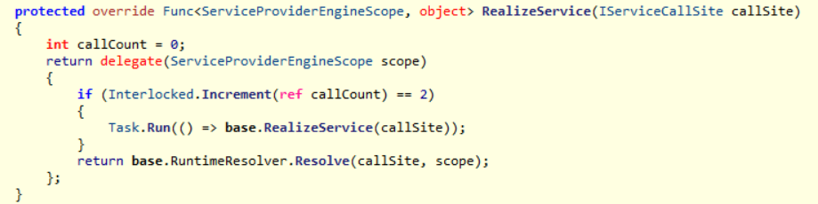

# Microsoft.Extensions.DependencyInjection 之二：使用诊断工具观察内存占用

[TOC]

## 准备工作

Visual Studio 从2015 版本起携带了诊断工具，可以很方便地进行实时的内存与 CPU 分析，将大家从内存 dump 和 windbg 中解放出来。本文使用大量接口进行注入与实例化测试以观察内存占用，除 Visual Studio 外还需要以下准备工作。

* 大量接口与实现类的生成（可选），见下方
* elasticsearch+kibana+apm，见下方
* asp.net core 应用，见下方

### 大量接口与实现类的生成

使用 TypeScript 循环生成了1万个接口，写入项目的 Foo.cs 文件

```typescript
import * as commander from 'commander';
import * as format from 'string-template';

let prefix =
`using Microsoft.Extensions.DependencyInjection;
using System;
using System.Collections.Generic;
using System.Text;

namespace WebApplication1
{`;

let fooTemplate =`
    interface IFoo\_{n} {
        void Hello();
    }
    
    class Foo_{n} : IFoo\_{n} {
        public void Hello() {
        }
    }
`;

(async function () {
    let args = commander
        .version('0.0.1')
        .option('-n, --count [value]')
        .parse(process.argv);
    let count = parseInt(args.count, 10);

    console.log(prefix);
    for (let i = 0; i < count; i++) {
        let src = format(fooTemplate, {n: i});
        console.log(src);
    }
    console.log('}');
})();
```

通过参数`count`控制生成的接口与实现类的数量，再使用 Shell 将打印内容写入 CSharpe 文件中。

```bash
T480@PC-XXXXXXXXX ~/source/repos/gvp-integration-test
$ ts-node test -n 10000 > ~/source/repos/WebApplication1/WebApplication1/Foo.cs
```

于是我们拥有了 IFoo\_0 到 IFoo\_9999 这1万个接口与对应的实现。

> 该方式是可选的，相当多的工具或者手写代码均可达到目的。

### elasticsearch+kibana+apm

使用 docker-compose 完成部署，相关文档很多，不是本文的关注点，略。

### asp.net core 应用

添加了以下依赖，使用上述生成的1万个接口进行测试。

* Microsoft.Extensions.DependencyInjection，版本 2.11
* Elastic.Apm.NetCoreAll，版本 1.1.2

然后在程序启动时使用反射注入以 IFoo\_ 相关的接口与其实现。

```c#
var types = Assembly.GetExecutingAssembly().GetTypes();
var fooInterfaces = types.Where(x => x.IsInterface && x.Name.StartsWith("IFoo_"));
foreach (var item in fooInterfaces)
{
    var impl = types.Single(x => x.IsClass && item.IsAssignableFrom(x));
    services.AddTransient(item, impl);
}
```

路由 `/api/realized/get-many` 的逻辑是获取大量以 IFoo\_ 作为前缀的接口实例，通过 queryString 中的 count 控制获取的数量，实现如下：

```c#
[HttpGet("get-many")]
public void GetManyService(Int32 count = -1)
{
    _logger.LogInformation("[GetManyService] start");
    var fooInterfaces = Assembly.GetExecutingAssembly().GetTypes()
        .Where(x => x.IsInterface && x.Name.StartsWith("IFoo"));

    if (count > -1)
    {
        fooInterfaces = fooInterfaces.Where(x => Int32.Parse(x.Name.Split('_')[1]) < count);
    }

    using (CurrentTransaction.Start(nameof(GetManyService), "GetRequiredService"))
    {
        foreach (var item in fooInterfaces)
        {
            _services.GetRequiredService(item);
        }
    };
    _logger.LogDebug("[GetManyService] finish");
}
```

## 请求与快照

程序启动和运行期间获取了5份快照，分别在以下时机：

* 第1次快照：应用程序启动后，进程内存约76.4MB；
* 第2次快照：依赖注入加载完成，进程内存约248.9MB；
* 第3次快照：第1次请求 `/api/realized/get-many?count=10000`，循环获取前述1万个 `IFoo\_N`接口后，进程内存约  271.8MB；
* 第4次快照：第2次请求 `/api/realized/get-many?count=10000`，进程内存约 308.2MB；
* 第5次快照：连续地请求 `/api/realized/get-many?count=10000` 若干次后调用一次 GC，进程内存约 305.2MB；


### Kibana 上的请求记录

下图显示了 Kibana 记录的所有的请求，下图中 transaction.type=request 的是 HTTP 请求，url.path 是请求地址，记录以时间倒序。其他记录是由 [elastic/apm]( https://github.com/elastic/apm-agent-dotnet ) 生成的。

*  transaction.duration.us：单次请求的耗时，微秒单位；
*  span.duration.us：发生在请求 /api/realized/get-many 的内部，获取大量以 IFoo\_ 命名接口实例的耗时，微秒单位；


## 请求耗时的分析

请求的主体逻辑是获取大量以 IFoo\_ 命名接口实例，仅观察请求级别的耗时变化，就能够反映获取大量以 IFoo\_ 命名接口实例的效率变化：

* 第1次完成 /api/realized/get-many 耗时 931ms；
* 第2次完成 /api/realized/get-many 耗时 301ms；
* 第3次及后续完成 /api/realized/get-many 耗时在 16ms-32ms 之前；

## 请求内存的分析

5 次快照的简要数据如下

| ID   | Time   | Live Objects    | Managed Heap            | 进程内存 |
| ---- | ------ | --------------- | ----------------------- | -------- |
| 1    | 4.29s  | 25455           | 2123.18KB               | 76.4MB   |
| 2    | 31.29s | 73429(+47974)   | 6525.04KB(+4401.86KB)   | 248.9MB  |
| 3    | 39.69s | 124907(+51478)  | 9605.48KB(+3080.45KB)   | 271.8MB  |
| 4    | 48.09s | 377403(+252496) | 25139.20KB(+15533.72KB) | 308.2MB  |
| 5    | 62.64s | 378407(+1004)   | 25224.86KB(+85.66KB)    | 305.2MB  |

### 第2次快照与第1次快照的对比：依赖注入加载完成

获取第1次快照时应用程序处于启动中，观察内存平稳后获取第2次快照，故两次快照的差异是由注册依赖注入方式产生的。由上一篇文章关于`CallSiteFactory`的内容已知，注册依赖注入方式的过程是，是`ServiceDescriptor` 的创建过程。

在此过程中进程内存增长了248.9MB-76.4MB=172.5MB，但值得一说的是即便零自定义注入，asp.net core 应用完成启动后也会有相当幅度的内存增长，需要横向对比。


我们注入了1万个以 IFoo\_ 作为命名前缀的接口与其实现，它们被添加到注入方式集合即 `ServiceDescriptor`数量，同时 asp.net core 自身的基础设置同样以此方式加载，故最终多于 1万条记录。

#### Microsoft.Extensions.DependencyInjection.ServiceDescriptor	+10,192	+570,752	+575,168	10,238	573,328	583,472

由于`CallSiteFactory`使用内部成员`List<ServiceDescriptor> _descriptors`持有了所有注入方式的列表，故其引用数量增加。


##### List<Microsoft.Extensions.DependencyInjection.ServiceDescriptor>	+20,498	20,549

虽然注入方式列表有1万多条，但它们会被第一时间分组，导致引用数量翻倍成2万多条，见下方描述。

##### Dictionary<Type, Microsoft.Extensions.DependencyInjection.ServiceLookup.CallSiteFactory+ServiceDescriptorCacheItem>	+10,210	10,251

`CallSiteFactory`使用 `List<ServiceDescriptor>`作为构造函数参数，在实例化的同时对注入方式进行了分组，分组结果存储在内部成员`Dictionary<Type, ServiceDescriptorCacheItem> _descriptorLookup`中。


### 第3次与第2次快照的对比：接口被实例化，委托被缓存

发起第1次请求 `/api/realized/get-many?count=10000`后获取了第3次快照，快照的差异由大量以 IFoo\_ 作为前缀的接口被实例化的过程中产生的。

在此过程中进程内存增长了271.8MB-248.9MB=22.9MB。


根据前文描述，我们知道了`CallSiteFactory`完成了目标实例上下文 即`IServiceCallSite`的创建，并以内部字典 `Dictionary<Type, IServiceCallSite> _callSiteCache` 进行了缓存。


#### Microsoft.Extensions.DependencyInjection.ServiceLookup.TransientCallSite	+10,000	+320,000	+720,000	10,064	322,048	765,848

本实践中使用的以 Foo\_ 作为命名前缀的实现均为无参构造函数，故生成1万个`CreateInstanceCallSite`实例，且独占内存与非独占内存以相同幅度增长。

回顾`CallSiteFactory` 创建组件实例化上下文`IServiceCallSite`过程：

> `CallSiteFactory`对不同注入方式有选取优先级，优先选取实例注入方式，其次选取委托注入方式，最后选取类型注入方式，以 `TryCreateExact()`为例简单说明：
> 1. 对于使用单例和常量的注入方式，返回`ConstantCallSite`实例；
> 2. 对于使用委托的注入方式，返回`FactoryCallSite`实例；
> 3. 对于使用类型注入的，`CallSiteFactory`调用方法`CreateConstructorCallSite()`；
>    * 如果只有1个构造函数
>      * 无参构造函数，使用 `CreateInstanceCallSite`作为实例化上下文；
>      * 有参构造函数存，首先使用方法`CreateArgumentCallSites()`遍历所有参数，递归创建各个参数的 `IServiceCallSite` 实例，得到数组。接着使用前一步得到的数组作为参数， 创建出 > `ConstructorCallSite`实例。
>    * 如果多于1个构造函数，检查和选取最佳构造函数再使用前一步逻辑处理；
> 4. 最后添加生命周期标识

#### Microsoft.Extensions.DependencyInjection.ServiceLookup.CreateInstanceCallSite	+10,000	+400,000	+400,000	10,027	401,080	401,080

组件实例化上下文`IServiceCallSite`被创建完成后，将添加生命周期标识（见截图的 `ApplyLifetime()`方法。


本实践中全部使用了 `Transient`生命周期标识，故生成1万个`TransientCallSite`实例，并引用 `CreateInstanceCallSite`实例，使独占内存与非独占内存以不同幅度增长。


计算独占内存增长与非独占内存增长，320,000+400,000=720,000 可以印证。

|Object Type|Size.(Bytes)|Inclusive Size Diff.(Bytes)|
|----|----|----|
|Microsoft.Extensions.DependencyInjection.ServiceLookup.TransientCallSite|320,000|720,000|
|Microsoft.Extensions.DependencyInjection.ServiceLookup.CreateInstanceCallSite | 400,000|400,000|

#### Func<Microsoft.Extensions.DependencyInjection.ServiceLookup.ServiceProviderEngineScope, Object>	+10,000	+640,768	+1,120,936	10,060	648,536	1,133,768

第1次请求完成后，`ServiceProviderEngine.CreateServiceAccessor()`调用子类的`DynamicServiceProviderEngine.RealizeService()` 方法返回1万个委托。



#### ConcurrentDictionary+Node<Type, Func<Microsoft.Extensions.DependencyInjection.ServiceLookup.ServiceProviderEngineScope, Object>>	+10,000	+480,000	+1,600,936	10,060	482,880	1,616,584

这1万个委托被 `ServiceProviderEngine` 缓存在成员 `ConcurrentDictionary<Type, Func<ServiceProviderEngineScope, object>> RealizedServices`中。


#### Microsoft.Extensions.DependencyInjection.ServiceLookup.DynamicServiceProviderEngine+<>c__DisplayClass1_0	+9,997	+479,856	+479,856	10,045	482,160	482,704

`DynamicServiceProviderEngine.RealizeService()`返回的是匿名委托，经常使用反编译工具的同学知道这是编译器行为以进行变量捕获。为什么是 9997 而不是1万，推测是匿名委托被编译的过程还没有完成，可以从下文引用数的减少看到。由于数字不再精确，只简单列举引用内存占用不再计算。

|Object Type|Size.(Bytes)|Inclusive Size Diff.(Bytes)|
|----|----|----|
|Func\<Microsoft.Extensions.DependencyInjection.ServiceLookup.ServiceProviderEngineScope, Object\>|640,768|1120,936|
|ConcurrentDictionary+Node<Type, Func<Microsoft.Extensions.DependencyInjection.ServiceLookup.ServiceProviderEngineScope, Object>>|480,000|1600,936|
|Microsoft.Extensions.DependencyInjection.ServiceLookup.DynamicServiceProviderEngine+\<\>c__DisplayClass1_0|479,856|479,856|

### 第4次与第3次快照的对比：使用表达式树生成委托更新原有委托

第2次请求 `/api/realized/get-many`时，异步线程启动，`ExpressionsServiceProviderEngine`依赖的`ExpressionResolverBuilder`使用表达式树重新生成委托，并覆盖到原有缓存中。由于在请求完成且内存占用平稳后获取快照，可以认为表达式树解析已经完成，委托已经被全部替换，故对比快照反应了两种委托的开销差异。

在此过程中进程内存增长了308.2MB-271.8MB=36.4MB，对比第2次快照为308.2MB-248.9MB=59.3MB，可见表达式树对内存来说非常不经济。

反序排列引用数量，可以观察到前一步生成的1万个 Microsoft.Extensions.DependencyInjection.ServiceLookup.DynamicServiceProviderEngine+\<\>c__DisplayClass1_0 已经被释放。


正序排列引用数量。RuntimeMethodHandle 为表达式树生成的相关方法，由于相关知识储备不到位，不再展开。


第5次的快照与第4次快照相对，内存变化幅度不大，略过。

## 小结

在 Kibana 上作表与制图如下


前文结论见[请求耗时的分析](#请求耗时的分析)，得到了印证：

> 为了在性能与开销中获取平衡，`Microsoft.Extensions.DependencyInjection`在初次请求时使用反射实例化组件并缓存委托，再次请求时异步使用表达式树生成委托并更新缓存，使得后续请求性能得到了提升。

* 第1次请求使用反射完成组件的实例化，并将实例化的委托缓存，这是第2次请求比第1次的高效原因；
* 第2次请求的后台任务使用表达式树重新生成委托，使得第3次请求比第2次请求效率提升了一个数量级；
* 后续请求和第3次请求差别不大；

Microsoft.Extensions.DependencyInjection 并非是银弹，它的便利性是一种空间换时间的典型，我们需要对以下情况有所了解：

* 重度使用依赖注入的大型项目启动过程相当之慢；
* 如果单次请求需要实例化的组件过多，前期请求的内存开销不可轻视；
* 由于实例化伴随着递归调用，过深的依赖将不可避免地导致堆栈溢出；

